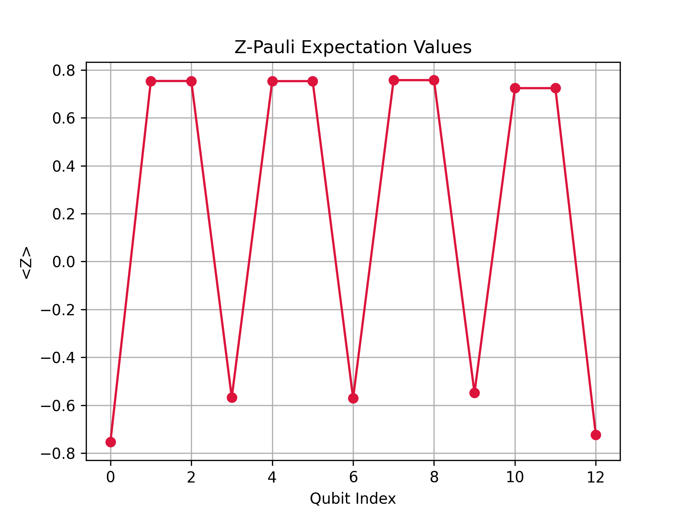
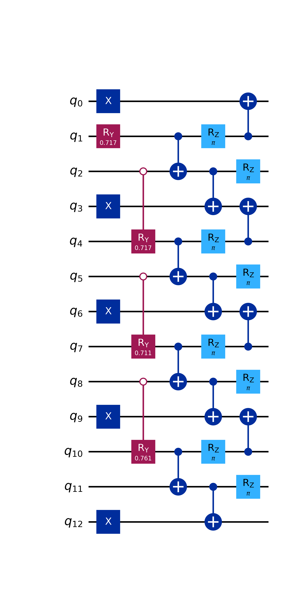

# Variational Preparation of Fractional Quantum Hall States

<div align="center">
  
  <p><em>Z-Pauli expectation values showing the preserved Charge Density Wave (CDW) order with quantum fluctuations characteristic of the v = 1/3 Laughlin state.</em></p>
</div>

## Overview
This project utilizes **IBM Qiskit** to simulate the quantum circuit preparation of Fractional Quantum Hall (FQH) states on a 1D qubit chain. Specifically, it targets the **Laughlin state**.

## Features
* **State Initialization:** Prepares the root partition $|100100\dots\rangle$ corresponding to the $\nu=1/3$ Charge Density Wave (CDW).
* **Parameterized Ansatz:** Uses layers of $R_y(\theta)$ and $CX$ gates to introduce many-body entanglement.
* **Measurement:** Calculates the local magnetization $\langle Z_i \rangle$ to verify the order parameter.
* **Visualization:** Automatically generates circuit diagrams and expectation value plots.

## Results Analysis

### 1. The Circuit Structure
The quantum circuit (below) implements the state preparation ansatz.
* **Initialization (Blue X Gates):** The qubits $q_0, q_3, q_6, \dots$ are flipped to $|1\rangle$, creating the initial pattern $|100100100\dots\rangle$.
* **Entanglement (Rotations & CNOTs):** The subsequent gates "melt" this crystalline order, introducing the necessary quantum superposition to approximate the topological ground state.

<div align="center">
  
</div>

### 2. Physical Interpretation of Data
The results graph (shown at the top) plots the expectation value $\langle Z_i \rangle$ for each site.
* **Period-3 Oscillation:** The data follows a clear pattern of "Down-Up-Up" ($\langle Z \rangle < 0$ followed by two $\langle Z \rangle > 0$), confirming that the system remains in the $\nu=1/3$ phase.
* **Quantum Fluctuations:** Crucially, the peaks do not reach the classical limits of $\pm 1.0$. The observed values of $\approx \pm 0.75$ indicate strong quantum fluctuations. This confirms that the system has evolved away from the trivial product state into a **macroscopic superposition**, a hallmark of the FQH liquid phase.

## Usage

### 1. Prerequisites
You will need Python installed along with Qiskit and Matplotlib:
```bash
pip install qiskit matplotlib numpy
